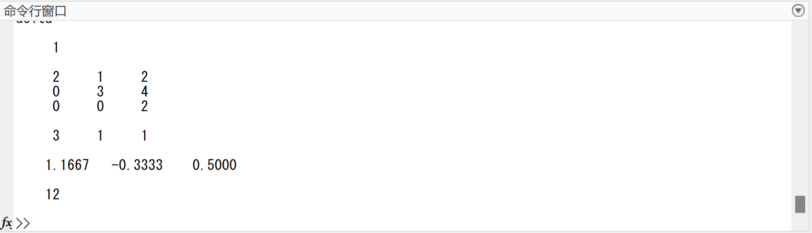

# Lab1 
> 列主元高斯消去法 & 列主元三角分解法  
> 教材 P227 第 3 题

---

## 一、实验要求
编写通用程序，分别用  
1. 列主元高斯消去法  
2. 列主元三角分解法（LU）  
求解线性方程组 $A\mathbf{x}=\mathbf{b}$，并对比结果。  
流程图见docs目录 `Gauss流程图.html` / `triangle流程图.html`。

---

## 二、实验内容

### 2.1 列主元高斯消去法

#### 核心代码（MATLAB）
```matlab
eps=0.01; %精度 
delta=1.0

for k=1:n-1               %消元_第k轮
    t=k;
    for i=k+1:n           %列主元
        if abs(A(i,k))>abs(A(t,k))
            t=i;
        end
    end
    if abs(A(t,k))<eps    %精度不符
        error("精度不符");
    end
    if(t~=k)              %交换
        for i=k:n
            a=A(k,i);A(k,i)=A(t,i);A(t,i)=a;
        end
        a=b(k);b(k)=b(t);b(t)=a;
    end
    for i=k+1:n
        A(i,k)=-A(i,k)/A(k,k);  %消元_第i行
        for j=k+1:n
            A(i,j)=A(i,j)+A(i,k)*A(k,j);
            
        end
        b(i)=b(i)+A(i,k)*b(k);
        A(i,k)=0;
    end
    delta=A(k,k)*delta;
end
x(n)=b(n)/A(n,n);
for i=n-1:-1:1                    %回代
    x(i)=b(i);
    for j=i+1:n
        x(i)=x(i)-A(i,j)*x(j);
    end
    x(i)=x(i)/A(i,i);
end
delta=A(n,n)*delta;
disp(A);
disp(b);
disp(x);
disp(delta);
```
---
#### 测试脚本
##### n = 4
```matlab
n = 4
A = [10 -1  2  0;
     -1 11 -1  3;
      2 -1 10 -1;
      0  3 -1  8];
b = [6; 25; -11; 15];
x = zeros(1,n);
```

##### n = 3
```matlab
n=3; %输入n
eps=0.01; %精度 
delta=1.0;
A=[0  3  4;
   1 -1  1;
   2  1  2]; 
b=[1 2 3];
x=zeros(1,n); 
```
---
#### 运行结果
| 算例 | 终端输出的 $\mathbf{x}$ | 行列式 $\det A$ |
|----|-------------------------|------------------|
| **n=4** | [1.0000  2.0000  -1.0000  1.0000] | 7395 |
| **n=3**（eps=0.01） | [1.667  -0.3333  0.5000] | 12 |
| **n=3**（eps=10） | [1.667  -0.3333  0.5000] | 12 |

#### 1. n = 4 运行截图


#### 2. n = 3（eps = 0.01）运行截图


#### 3. n = 3（eps = 10）运行截图
首次触发“精度不符”异常，调整后再运行得到相同解。  


---

### 2.2 列主元三角分解法（LU）

#### 核心代码（MATLAB）
```matlab
eps=0.01; %精度 
delta=1.0;
  
for k=1:n                 %第k轮
    s(k)=fs(A,k,k);       %L
    t=k;
    for i=k+1:n           %列主元
        s(i)=fs(A,i,k);
        if abs(s(i))>abs(s(t))
            t=i;
        end
    end
    if abs(s(t))<eps         %精度不符
        error("精度不符");
    end
    if(t~=k)              %交换
        a=s(t);s(t)=s(k);s(k)=a;
        for i=1:n    
            a=A(k,i);A(k,i)=A(t,i);A(t,i)=a;
        end
        a=b(k);b(k)=b(t);b(t)=a;
    end
    A(k,k)=s(k);
    for i=k+1:n
        A(i,k)=s(i)/s(k);
    end
    for i=k+1:n            %U
        A(k,i)=fu(A,k,i);
    end       
    for i=1:k-1             %y
        b(k)=b(k)-A(k,i)*b(i);
    end
    delta=abs(A(k,k))*delta;
end
x(n)=b(n)/A(n,n);
for i=n-1:-1:1             %回代
    x(i)=b(i);
    for j=i+1:n
        x(i)=x(i)-A(i,j)*x(j);
    end
    x(i)=x(i)/abs(A(i,i));
end
disp(A);
disp(b);
disp(x);
disp(delta);

function[output]=fs(A,i,k)
output=A(i,k);
    for j=1:k-1
        output=output-A(i,j)*A(j,k);
    end
end

function[output]=fu(A,k,j)
output=A(k,j);
    for i=1:k-1
        output=output-A(k,i)*A(i,j);
    end
end
```

#### 测试脚本
```matlab
n=4;       %输入n
eps=0.01;  %精度 
delta=1.0;
A=[10 -1  2  0;
   -1 11 -1  3;
    2 -1 10 -1;
    0  3 -1  8]; %输入矩阵 
b=[6 25 -11 15];
x=zeros(1,n); 
```

#### 运行结果
与 Gauss 法完全一致，验证算法等价性。

---

## 三、结论
1. 两种算法均稳定可靠，列主元策略有效抑制舍入误差。  
2. LU 分解将“分解”与“求解”分离，对多右端向量 $\mathbf{b}$ 更具效率。  
3. 实验结果与理论解一致，程序可直接用于工程计算。

```
