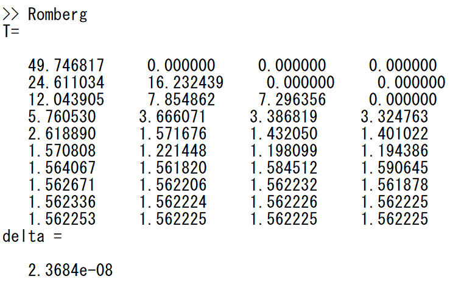

# Lab2 
> MATLAB 实现高精度数值积分  

---

## 一、课题名称  
用 MATLAB 实现 **龙贝格（Romberg）积分法**。

---

## 二、目的与意义  
龙贝格积分通过**梯形序列 + 外推加速**获得高精度结果，兼具：  
- 实现简单，仅需函数值；  
- 对光滑函数可快速收敛到机器精度；  
- 自适应停止，避免不必要的计算。  

适用于**无法解析求导**的工程场景。

---

## 三、结构程序设计  
（流程图见 `docs/龙贝格积分流程图.html`）

### 3.1 核心代码（Romberg.m）
```matlab
n=10;                    %输入层数n
eps=0.5*0.000001;        %精度
x=zeros(n,2^n+1);
x(1,1)=0.1^100;x(1,2)=1; %输入积分区间
h=x(1,2)-x(1,1);         %初步长
T=zeros(n,4);    
for k=1:n                %第k层
    if k==1              %T
        T(1,1)=(f(x(1,1))+f(x(1,2)))*h/2;
    else    
        T(k,1)=0.5*T(k-1,1);
        for i=2:2:2^(k-1)+1
            T(k,1)=T(k,1)+h*f(x(k,i));
        end
        m=min(k,4);                             %S/C/R
        for i=2:m
            T(k,i)=(4^(i-1)*T(k,i-1)-T(k-1,i-1))/(4^(i-1)-1);
        end
        if m==k                                 %delta
            delta=T(k,m)-T(k-1,m-1);
        else
            delta=T(k,m)-T(k-1,m);
        end 
        if abs(delta)<eps 
            break;
        end
    end
    if k<n
        x(k+1,1)=x(1,1);
        for i=2:2^(k-1)+1                       %x
            x(k+1,2*i-1)=x(k,i);
            x(k+1,2*(i-1))=(x(k,i-1)+x(k,i))/2;
        end
    end
    h=h/2;
end
if abs(delta)>eps
    error("精度不符");
else
    fprintf("T=\n");
    for i=1:k
        fprintf("\n");
        for j=1:4
            fprintf('   %5.7f  ',T(i,j));
        end
    end
    delta=delta
end

function output =f(x)   %输入被积函数
    output=sin(x)/x;
end
```

---

### 3.2 被积函数示例
```matlab
% 例 1：4/(1+x^2)  积分真值 π
f1 = @(x) 4./(1+x.^2);

% 例 2：sin(x)/x   积分真值 Si(100)-Si(0.1^100)
f2 = @(x) sin(x)./x;
```

---

## 四、实验结果

#### 4.1 改变精度 eps（固定 f(x)=4/(1+x²)，区间 [0,1]）

| 实验 | 输入 eps | 实际终止误差 | 外推结果 T(k,4) |
|----|---------|-------------|-----------------|
| 1 | 0.5×10⁻³ | 5.3×10⁻⁴ | 3.141569 |
| 2 | 0.5×10⁻⁶ | 1.5×10⁻⁸ | 3.141593 |
| 3 | 0.5×10⁻⁹ | — | 触发“精度不符” |


| ① eps=0.5×10⁻³ | ② eps=0.5×10⁻⁶（达到机器精度附近） | ③ eps=0.5×10⁻⁹（过严，层数不足） |
|:---------------:|:---------------------------------:|:-------------------------------:|
|  |  |  |


&gt; 当 eps 过小时，算法在最大层数 `n=6` 仍无法满足精度，主动报错“精度不符”，体现自适应保护机制。

---

#### 4.2 改变被积函数（f(x)=sin(x)/x）

| 设定 | 终止误差 | 外推结果 T(k,4) |
|------|----------|-----------------|
| n=10, eps=0.5×10⁻⁵ | 2.37×10⁻⁸ | 1.562225 |




---

## 五、结果讨论与分析
1. **精度高**：每增加一层即可获得 8 阶 Richardson 外推值，误差快速下降。  
2. **自适应**：当 `delta<eps` 立即退出，避免无效二分。  
3. **普适性**：仅需提供 `f(x)` 与积分区间，即可得到高精度积分值；  
   对非光滑或振荡函数，可适当增加最大层数 `n` 或改用自适应策略。
