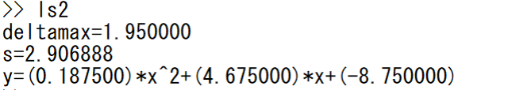
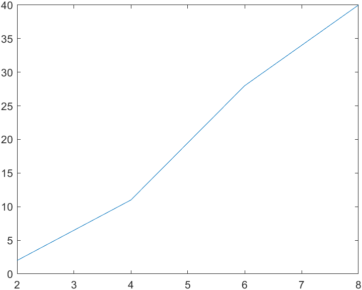
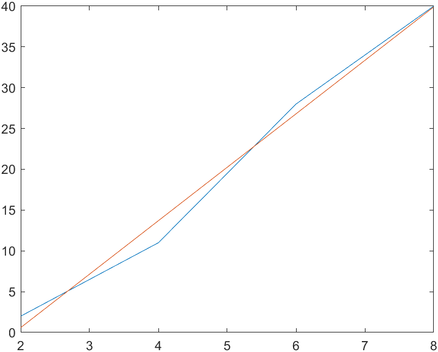
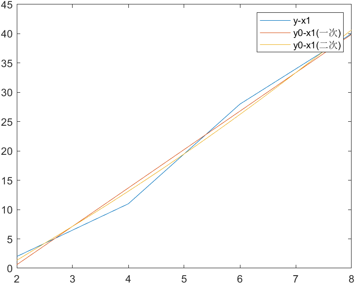

# Lab3

## 一、课题名称

最小二乘法解p89第一题。

## 二、目的和意义

利用最小二乘法可以简便地求得未知的数据，并使得这些求得的数据与实际数据之间误差的平方和最小。

## 三、结构程序设计

用到的函数文件：

### 1. triangle.m

```matlab
function[a]=triangle(A,b,n)
eps=0.01; %精度
a=zeros(1,n);
for k=1:n %第k轮
    s(k)=fs(A,k,k); %L
    t=k;
    for i=k+1:n %列主元
        s(i)=fs(A,i,k);
        if abs(s(i))>abs(s(t))
            t=i;
        end
    end
    if abs(s(t))<eps %精度不符
        error("精度不符");
    end
    if(t~=k) %交换
        a=s(t);s(t)=s(k);s(k)=a;
        for i=1:n
            a=A(k,i);A(k,i)=A(t,i);A(t,i)=a;
        end
        a=b(k);b(k)=b(t);b(t)=a;
    end
    A(k,k)=s(k);
    for i=k+1:n
        A(i,k)=s(i)/s(k);
    end
    for i=k+1:n %U
        A(k,i)=fu(A,k,i);
    end
    for i=1:k-1 %y
        b(k)=b(k)-A(k,i)*b(i);
    end
end
a(n)=b(n)/A(n,n);
for i=n-1:-1:1 %回代
    a(i)=b(i);
    for j=i+1:n
        a(i)=a(i)-A(i,j)*a(j);
    end
    a(i)=a(i)/A(i,i);
end
```

### 2. fu.m

```matlab
function[output]=fu(A,k,j)
output=A(k,j);
for i=1:k-1
    output=output-A(k,i)*A(i,j);
end
end
```

### 3. fs.m

```matlab
function[output]=fs(A,i,k)
output=A(i,k);
for j=1:k-1
    output=output-A(i,j)*A(j,k);
end
end
```

## 主代码：

### 1. 一次曲线（ls1.m）

#### （1）代码

```matlab
x1=[2 4 6 8];
y=[2 11 28 40];
plot(x1,y);
hold on
%一次
n=2; %φ个数（次数）+1（即矩阵行数）
nx=4; %x个数
A=zeros(n,n); %(φ内积矩阵)
b=zeros(1,n); %等号右边含y列向量
x=zeros(n*2-1,nx);
y0=zeros(1,nx);
s=0;
for i=1:n*2-1 %计算x的幂
    for j=1:nx
        x(i,j)=x1(j)^(i-1);
    end
end
for i=1:n %计算A,b
    for j=i:n
        for m=1:nx
            A(i,j)=A(i,j)+x(i+j-1,m);
            if j==i
                b(i)=b(i)+y(m)*x(i,m);
            end
        end
    end
    A(j,i)=A(i,j);
end
a=triangle(A,b,n); %ak
for i=1:nx %拟合得到
    y0(i)=x1(i)*a(2)+a(1);
end
delta=y-y0; %最大偏差
for i=1:nx
    delta(i)=abs(delta(i));
end
deltamax=max(delta);
for i=1:nx
    s=s+delta(i)^2;
end
s=s^0.5;
fprintf("deltamax=%f\n",deltamax);
fprintf("s=%f\n",s);
fprintf("y=(%f)*x+(%f)\n",a(2),a(1));
plot(x1,y0);
hold off
```

#### （2）实验结果

选定一次曲线，运行ls1.m文件得到命令行窗口显示结果如下（曲线对比见后）：
<p align="center">
    <strong>一次拟合结果</strong><br>
    
</p>

### 2. 二次曲线（ls2.m）

#### （1）代码

```matlab
x1=[2 4 6 8];
y=[2 11 28 40];
plot(x1,y);
hold on
%二次
n=3; %φ个数（次数）+1（即矩阵行数）
nx=4; %x个数
A=zeros(n,n); %(φ内积矩阵)
b=zeros(1,n); %等号右边含y列向量
x=zeros(n*2-1,nx);
y0=zeros(1,nx);
a=zeros(1,n);
s=0;
for i=1:n*2-1 %计算x的幂
    for j=1:nx
        x(i,j)=x1(j)^(i-1);
    end
end
for i=1:n %计算A,b
    for j=i:n
        for m=1:nx
            A(i,j)=A(i,j)+x(i+j-1,m);
            if j==i
                b(i)=b(i)+y(m)*x(i,m);
            end
        end
        A(j,i)=A(i,j);
    end
end
a=triangle(A,b,n); %ak
for i=1:nx %拟合得到
    y0(i)=x1(i)^2*a(3)+x1(i)*a(2)+a(1);
end
delta=y-y0; %最大偏差
for i=1:nx
    delta(i)=abs(delta(i));
end
deltamax=max(delta);
for i=1:nx
    s=s+delta(i)^2;
end
s=s^0.5;
fprintf("deltamax=%f\n",deltamax);
fprintf("s=%f\n",s);
fprintf("y=(%f)*x^2+(%f)*x+(%f)\n",a(3),a(2),a(1));
values = spcrv([[x1(1) x1 x1(end)];[y0(1) y0 y0(end)]],3);
plot(values(1,:),values(2,:));
hold off
```

#### （2）实验结果

选定二次曲线，运行ls2.m文件得到命令行窗口显示结果如下：
<p align="center">
    <strong>二次拟合结果</strong><br>
    
</p>

| 原始数据 | 一次拟合 | 对比效果 |
|:--------:|:--------:|:--------:|
|  |  |  |

**说明：**
- **左图**：未选定拟合曲线时的实际数据y-x1折线图
- **中图**：一次拟合多项式y0-x1曲线图  
- **右图**：一次与二次拟合效果对比图
---

## 四、结果讨论和分析

拟合得到：
- **一次多项式**：y = (6.550000)×x + (-12.500000)
  - deltamax₁ = 2.700000
  - s₁ = 3.271085

- **二次多项式**：y = (0.187500)×x² + (4.675000)×x + (-8.750000)
  - deltamax₂ = 1.950000  
  - s₂ = 2.906888

**结论**：deltamax₁ > deltamax₂，s₁ > s₂，故用二次多项式拟合误差更小，拟合效果更好。
